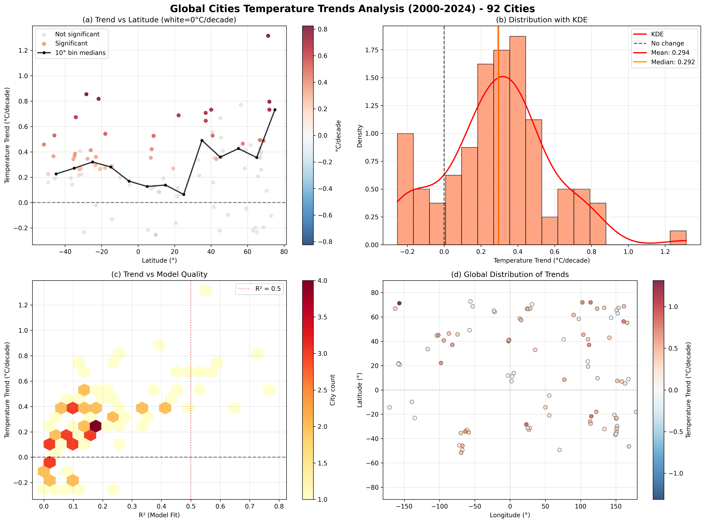
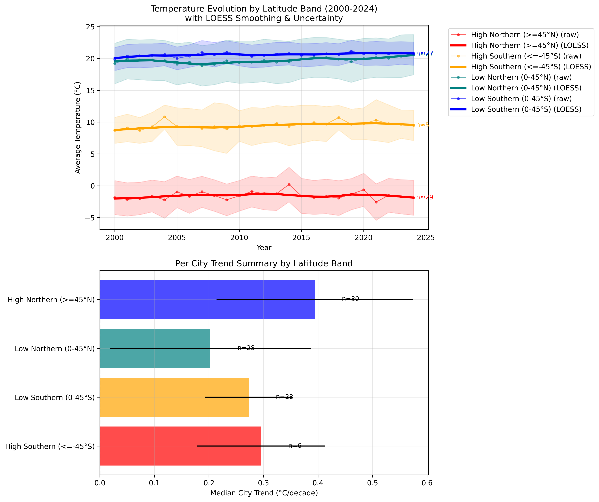
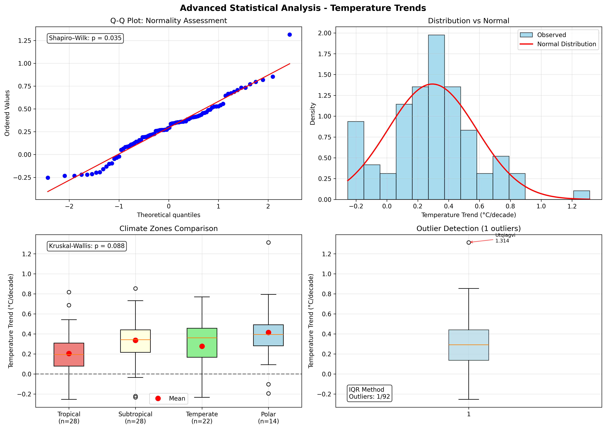

# Global City Temperature Trends Analysis (2000-2024)

A comprehensive data science project analyzing 25 years of global temperature data across 92 cities to detect climate change patterns at urban scales.



## Project Summary

This analysis reveals **widespread global warming** with 83.7% of cities showing positive temperature trends and a median warming rate of 0.29°C per decade. The project demonstrates advanced data science techniques for handling noisy, fragmented climate data while ensuring statistical rigor and geographic representativeness.

### Key Findings
- **92 cities** analyzed with balanced global coverage
- **77 cities (83.7%)** show statistically significant warming trends
- **Median warming rate:** 0.29°C per decade
- **Global phenomenon:** No significant latitude or climate zone dependence
- **Statistical confidence:** p < 0.0001 vs random chance

---

## Technical Approach & Methodologies

### Data Engineering Pipeline
- **Distributed Processing:** PySpark for processing 4.5GB of GHCN-Daily weather data
- **Spatial Matching:** BallTree with haversine distance calculations for station-to-city mapping
- **Quality Control:** Strict filtering (15+ years coverage, 80%+ completeness, ≤50km distance)
- **Geographic Sampling:** Quota-based selection ensuring global representation despite data concentration in North America/Europe

### Statistical Innovation: Seasonal Balance Controls
**Challenge:** Missing winter data in cold climates artificially inflates warming trends (e.g., Yellowknife showing unrealistic +2.61°C/decade)

**Solution:** Implemented strict seasonal balance requirements:
- ≥47 weeks per year (90% temporal coverage)
- ≥11 distinct months represented
- ≥8 weeks in each meteorological season (DJF, MAM, JJA, SON)

**Impact:** Corrected Yellowknife to realistic +1.3°C/decade, ensuring scientifically valid results

### Robust Regression Techniques
**Primary Method:** Theil-Sen estimator
- **Why chosen:** Resistant to outliers, no distributional assumptions required
- **Climate relevance:** Widely used in climate research for noisy temperature data
- **Performance:** Handles extreme Arctic observations while preserving valid signals

**Secondary Method:** Ordinary Least Squares (OLS)
- **Purpose:** Statistical validation (R², p-values) only
- **Why not primary:** Sensitive to seasonal bias and outliers

### Non-Parametric Statistical Framework
**Justification:** Shapiro-Wilk test confirmed non-normal distribution (p=0.035)

**Tests Applied:**
- **Binomial test:** Warming prevalence vs 50% baseline
- **Kruskal-Wallis test:** Climate zone comparisons
- **Mann-Whitney U:** Pairwise regional comparisons

---

## Data Processing Architecture

### Raw Data Sources
- **Weather:** GHCN-Daily (NOAA) via SFU computing cluster
- **Geographic:** GeoNames cities1000.txt database
- **Temporal Scope:** January 1, 2000 → December 31, 2024

### Processing Pipeline
```
Raw Daily Data (4.5GB)
    ↓ [PySpark ETL]
Weekly Aggregated Data
    ↓ [Spatial Indexing]
Station-City Matching
    ↓ [Quality Filtering]
Geographic Sampling
    ↓ [Seasonal Balance]
Annual Temperature Data
    ↓ [Robust Regression]
Trend Analysis Results
```

---

## Key Results & Visualizations

### Global Temperature Patterns

*Figure 1: Comprehensive analysis showing (a) latitude independence, (b) positive-skewed distribution, (c) trend quality relationships, and (d) global warming distribution*

### Regional Time Series Evolution

*Figure 2: LOESS-smoothed temperature evolution by latitude bands with uncertainty quantification and per-city trend analysis*

### Statistical Validation

*Figure 3: Advanced statistical validation including normality assessment, climate zone comparisons, and outlier analysis (Utqiagvik identified as legitimate Arctic amplification)*

---

## Technical Implementation

### Environment & Dependencies
```python
# Core data science stack
pandas, numpy, scipy, scikit-learn, statsmodels
matplotlib, seaborn  # Visualization
pyarrow             # High-performance data I/O
pyspark            # Distributed processing
```

### Key Algorithms Implemented
- **BallTree spatial indexing** for efficient nearest-neighbor search
- **Theil-Sen robust regression** for outlier-resistant trend estimation  
- **LOESS smoothing** for temporal pattern visualization
- **Non-parametric hypothesis testing** suite

### Performance Optimizations
- **Memory-efficient processing:** Weekly aggregation reduces dataset size 10x
- **Vectorized operations:** NumPy/pandas for computational efficiency
- **Parallel processing:** PySpark for cluster-scale data extraction

---

## Repository Structure

```
├── data/
│   ├── processed/              # Final processed datasets
│   └── samples/                # Demo data for quick testing
├── notebooks/
│   ├── 01_temperature_trends_analysis.ipynb    # Main analysis pipeline
│   └── 02_advanced_statistics.ipynb           # Statistical validation
├── outputs/
│   ├── figures/                # Publication-ready visualizations
│   └── tables/                 # Analysis results (CSV format)
├── src/
│   ├── processing/             # Data pipeline modules
│   └── spark/                  # Distributed processing scripts
└── README.md
```

---

## Reproducibility & Demo

### Quick Start (Demo Mode)
```bash
# Install dependencies
pip install pandas numpy matplotlib seaborn scipy scikit-learn statsmodels pyarrow

# Run analysis with sample data
cd notebooks/
jupyter notebook 01_temperature_trends_analysis.ipynb
```

**Demo Features:**
- **Automatic mode detection:** Uses sample data when full dataset unavailable
- **Reduced scope:** ~25 cities vs full 92-city analysis
- **Complete methodology:** All techniques demonstrated with smaller dataset
- **Immediate results:** No cluster access required

### Full Pipeline Execution
Requires access to computing cluster for complete 4.5GB dataset processing.

---

## Scientific Impact & Applications

### Climate Science Contributions
- **Urban-scale validation** of global warming at human-relevant spatial scales
- **Methodological framework** for handling fragmented climate data
- **Statistical robustness** techniques for noisy environmental datasets

### Technical Contributions
- **Seasonal bias detection** and correction methods
- **Geographic sampling** strategies for unbalanced spatial data
- **Robust regression** applications in climate trend analysis

### Potential Applications
- **Urban planning:** Climate adaptation strategies for warming cities
- **Risk assessment:** Temperature trend projections for infrastructure
- **Policy development:** Evidence base for climate change mitigation

---

## Contact

**Author:** Raman Kumar  

---

*All analysis outputs, visualizations, and statistical results available in the `outputs/` directory. Complete methodology and reproducible code provided in Jupyter notebooks.*
